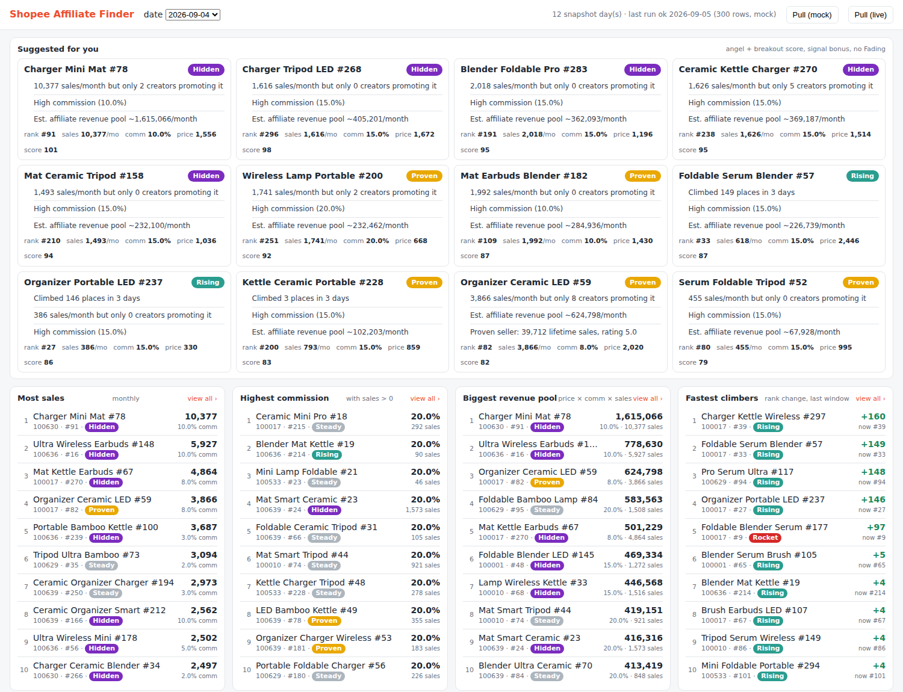
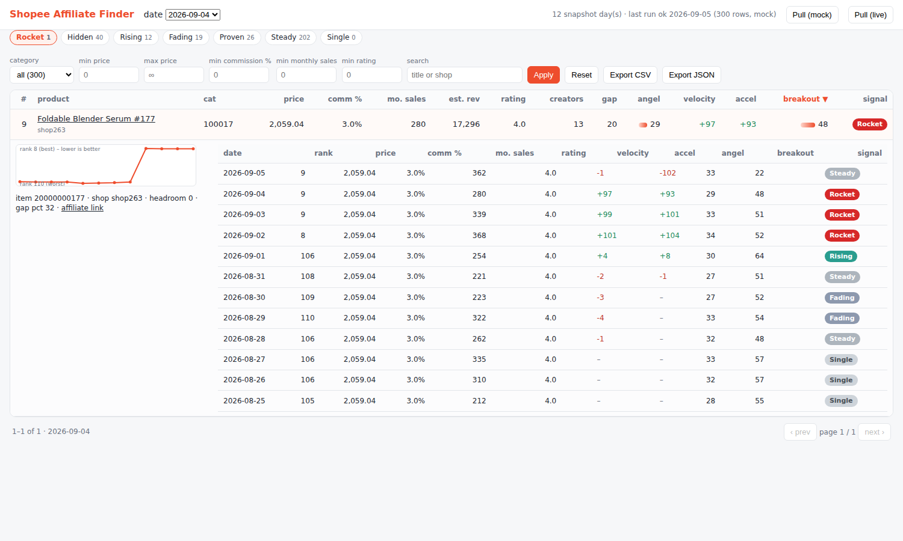

# Shopee Affiliate Finder

Personal Shopee affiliate product-research tool. Pulls the affiliate product feed once a day
through the official **Shopee Affiliate Open API** (signed GraphQL, no scraping), stores one
snapshot row per `(item_id, snapshot_date)`, computes signal metrics from the daily history, and
serves a filterable dashboard with CSV / JSON export. Single user, no auth, no SaaS backend.





## Stack

* Python 3.11+, FastAPI, psycopg 3, httpx, APScheduler
* Postgres (local, or Supabase's Postgres via `DATABASE_URL` - no auth / RLS needed)
* Frontend: one Jinja template + vanilla JS served by FastAPI

## Quick start

```bash
pip install -r requirements.txt
cp .env.example .env            # fill SHOPEE_APP_ID / SHOPEE_APP_SECRET / SHOPEE_REGION / DATABASE_URL
createdb shopee_aff             # or point DATABASE_URL at Supabase

python scripts/probe_api.py     # step 1: prove one live signed pull returns products
python -m shopee_aff.ingest     # step 2-4: pull today, store snapshot, compute metrics + signals
python -m uvicorn shopee_aff.api:app --port 8000   # dashboard at http://127.0.0.1:8000
```

No credentials yet? Try the whole pipeline on synthetic data:

```bash
python -m shopee_aff.ingest --backfill-mock 10    # 10 days of fake history with drifting ranks
python -m uvicorn shopee_aff.api:app --port 8000
```

`make probe | ingest | backfill-mock | recompute | serve | schedule | test` wrap the same commands.

## Layout

| Path | Purpose |
| --- | --- |
| `shopee_aff/config.py` | `.env` settings (pydantic-settings), thresholds, endpoint derivation |
| `shopee_aff/shopee_client.py` | GraphQL client: payload builder, request signing, pagination |
| `shopee_aff/queries.py` | every GraphQL document in one place (`productOfferV2`, ping, introspection) |
| `shopee_aff/normalize.py` | raw API node -> `SnapshotRow` |
| `shopee_aff/migrations/*.sql` | schema; applied by `python -m shopee_aff.db` or automatically on ingest / API start |
| `shopee_aff/metrics.py` | pure metric functions over a day's rows + rank history |
| `shopee_aff/signals.py` | rule-based buckets |
| `shopee_aff/ingest.py` | daily pull orchestration + CLI (`--mock`, `--date`, `--recompute`, `--backfill-mock`) |
| `shopee_aff/scheduler.py` | APScheduler daily job (in-process with the API, or standalone) |
| `shopee_aff/api.py` | FastAPI read endpoints, export, manual ingest trigger, dashboard |
| `shopee_aff/mock_source.py` | deterministic synthetic feed for dev / demo |
| `scripts/probe_api.py` | live-API smoke test + schema introspection |
| `tests/` | unit tests (signing, metrics, signals, normalisation) + optional DB integration test |

## Shopee Open API notes

* Endpoint is derived from `SHOPEE_REGION`: `https://open-api.affiliate.shopee.<region>/graphql`
  (`co.th`, `sg`, `com.my`, `co.id`, `vn`, `ph`, `com.br`, `tw`). Override with `SHOPEE_ENDPOINT`.
* Auth header: `Authorization: SHA256 Credential=<appId>, Timestamp=<unix>, Signature=<hex>`.
  The documented signature is a plain `SHA256(appId + timestamp + body + appSecret)` over the exact
  JSON body sent. That is the default (`SHOPEE_SIGNATURE_MODE=sha256`). An HMAC-SHA256 variant is
  available (`=hmac`); `python scripts/probe_api.py --try-both` tests both and tells you which to keep.
* Discovery uses `productOfferV2` as the bulk feed: `listType` (2 = top performing) and `sortType`
  (5 = highest sales) are configurable, paged up to `SHOPEE_MAX_PAGES` x `SHOPEE_PAGE_SIZE` per
  category id in `SHOPEE_CATEGORY_IDS` (blank = one un-filtered pull). `rank` is the item's
  position in that sorted feed. Each live pull also saves the raw nodes to `data/raw/<date>.json`.
* Real commission fields are stored: `commissionRate`, `sellerCommissionRate`, `shopeeCommissionRate`
  (as fractions, 0.05 = 5%).
* `cumulative_sales` and `partner_count` are **not** exposed by `productOfferV2`. They are stored as
  NULL and the metrics degrade gracefully (gap_score treats missing creators as 0; Proven never fires
  without cumulative sales). If your region exposes a richer feed (e.g. an item-feed query), run
  `python scripts/probe_api.py --introspect` to list every root query, then
  `--type <TypeName>` to see its fields, and add the mapping in `normalize.py`.
* `category` is the top-level `productCatIds[0]`; drop a `{"<catId>": "Name"}` map at
  `data/category_names.json` to show names instead of ids.

## Schema

`product_snapshots` - one raw row per `(item_id, snapshot_date)`: `shop_id, title, shop_name,
category, category_ids, price, price_max, discount_rate, commission_rate, seller_commission_rate,
shopee_commission_rate, monthly_sales, cumulative_sales, rating, partner_count, rank, image_url,
product_link, offer_link, raw (jsonb)`.

`product_metrics` - derived values for the same key: `est_monthly_revenue, gap_score,
gap_percentile, angel_score, rank_velocity, rank_acceleration, headroom, breakout_score,
history_days, signal`. Recomputable at any time with `python -m shopee_aff.ingest --recompute --date ...`.

`ingest_runs` - audit trail per pull. `product_day` - view joining the two tables.

## Metrics (`shopee_aff/metrics.py`)

| Metric | Definition |
| --- | --- |
| `est_monthly_revenue` | `price * commission_rate * monthly_sales` |
| `gap_score` | `monthly_sales / (partner_count + 1)` (high sales, few creators) |
| `angel_score` (0-100) | `0.40*sales' + 0.30*revenue' + 0.20*commission' + 0.10*rating'`, each component min-max normalised to 0-100 across the day (log scale for sales / revenue); missing components drop out and the weights renormalise |
| `rank_velocity` | `rank[t-N] - rank[t]` (positive = climbing); `N = VELOCITY_WINDOW_DAYS`, falls back to the nearest older snapshot within the window |
| `rank_acceleration` | `velocity[t] - velocity[t-N]` |
| `headroom` | `max(0, rank - ROCKET_TOP_N)` (distance to the top 10) |
| `breakout_score` (0-100) | mean of velocity', acceleration', gap', headroom' (each normalised to 0-100) |

## Signals (`shopee_aff/signals.py`, first match wins)

| Signal | Rule |
| --- | --- |
| Single | fewer than 2 snapshots (or no velocity yet) |
| Rocket | rank <= `ROCKET_TOP_N` today and > `ROCKET_TOP_N` one window ago |
| Proven | `cumulative_sales >= PROVEN_MIN_CUMULATIVE_SALES` and `rating >= PROVEN_MIN_RATING` |
| Hidden | `monthly_sales >= HIDDEN_MIN_MONTHLY_SALES` and gap_score percentile >= `HIDDEN_MIN_GAP_PERCENTILE` |
| Rising | `rank_velocity >= RISING_MIN_VELOCITY` |
| Fading | `rank_velocity <= FADING_MAX_VELOCITY` |
| Steady | has history but is not moving (neutral bucket so every row is classified) |

All thresholds live in `.env` (see `.env.example`). After tuning, `make recompute` re-classifies the
day without re-pulling.

## Daily pull

* In-process: the API starts an APScheduler job at `INGEST_HOUR:INGEST_MINUTE` (server local time)
  when `INGEST_ENABLED=1`.
* Standalone: `python -m shopee_aff.scheduler`.
* System cron instead: set `INGEST_ENABLED=0` and add
  `30 6 * * * cd /path/to/repo && python -m shopee_aff.ingest >> data/ingest.log 2>&1`.
* Manual: `POST /api/ingest` (or the "Pull" buttons in the UI; `?mock=1` for synthetic data).

## API

| Endpoint | Notes |
| --- | --- |
| `GET /api/home` | home panels: suggested picks (with reasons), most sales, highest commission, biggest revenue pool, fastest climbers |
| `GET /api/meta` | dates, categories, signal counts, recent runs |
| `GET /api/products` | `date, category, signal (comma list), min_price, max_price, min_commission (5 or 0.05), min_sales, min_rating, q, sort, order, limit, offset` |
| `GET /api/products/{item_id}` | latest row + full daily history |
| `GET /api/export.csv`, `GET /api/export.json` | same filters, up to 50k rows |
| `POST /api/ingest?mock=1&date=YYYY-MM-DD` | run a pull now |
| `GET /health` | DB connectivity |

## Tests

```bash
python -m pytest -q                                            # unit tests
TEST_DATABASE_URL=postgresql://.../shopee_aff_test python -m pytest -q   # + end-to-end DB/API test
```

## Open questions (resolve with `scripts/probe_api.py` once credentials are in)

1. Affiliate account approved and Open API enabled? -> `probe_api.py` exits 0 and prints products.
2. Region endpoint -> `SHOPEE_REGION`; the probe prints the host it hit.
3. Does the region expose an item-feed query with cumulative sales / creator counts? -> `--introspect`.
4. Signal thresholds -> tune in `.env`, then `make recompute`.

## Deploying on Railway

`railway.json` + `Procfile` describe the web service (uvicorn on `$PORT`, healthcheck on `/health`).
Add a Postgres service, then set on the web service:

```
DATABASE_URL=postgresql://postgres:<password>@<postgres private host>:5432/shopee_aff
SHOPEE_APP_ID=...   SHOPEE_APP_SECRET=...   SHOPEE_REGION=co.th
INGEST_ENABLED=1    INGEST_HOUR=23   # UTC on Railway (23:00 UTC = 06:00 Bangkok)
```

Migrations run on startup. Keep one replica so the in-process scheduler pulls exactly once a day.
